# Grain SaaS Architecture Diagrams

**Version:** 5.7.0 | **Last Updated:** 2026-01-11

Bu dokuman Grain SaaS Automation Suite'in tam mimari diyagramlarini icerir.

---

## 1. Genel Sistem Mimarisi

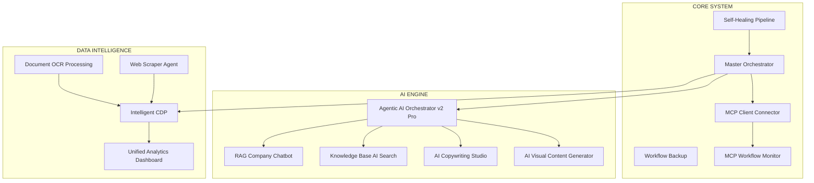

---

## 2. Modul Baglantilari (19 Modul)

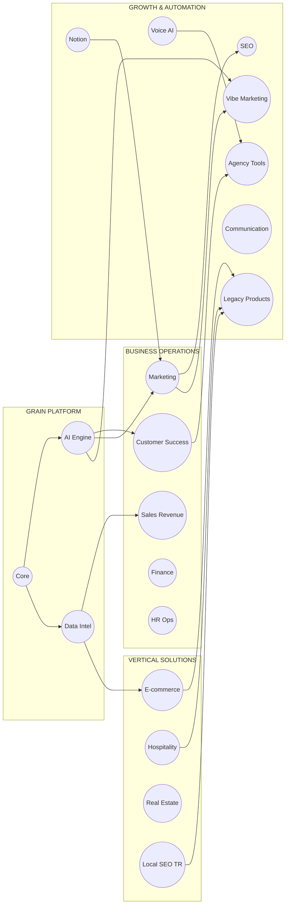

---

## 3. E-commerce Modulu Detay

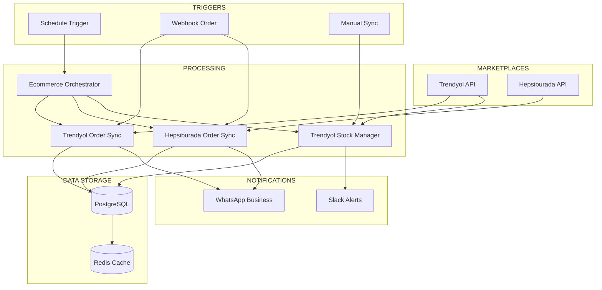

---

## 4. Vibe Marketing Modulu

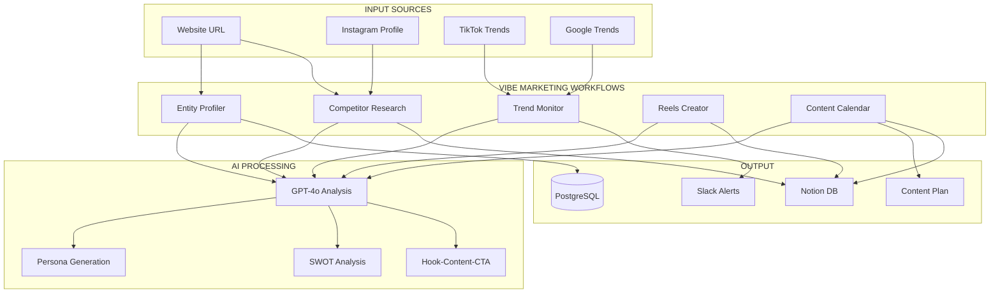

---

## 5. Marketing Agent Iliski Diyagrami

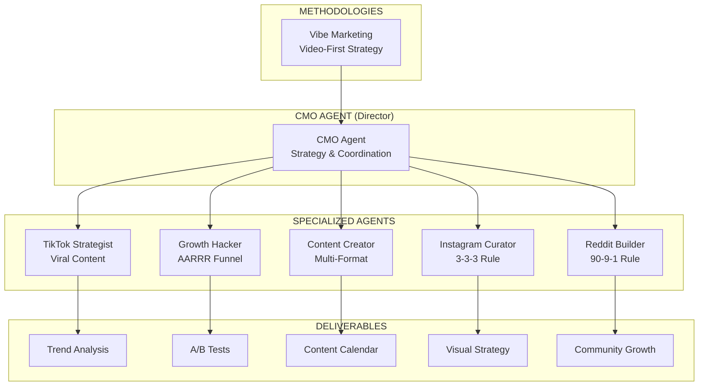

---

## 6. Legacy Products Starter Pack

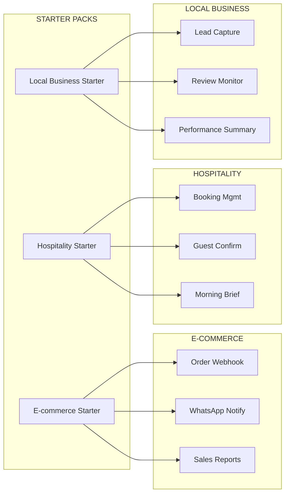

---

## 7. Customer Success Pipeline

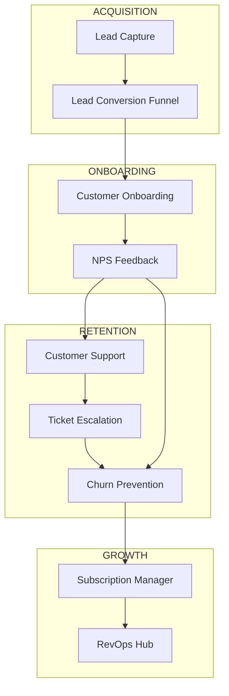

---

## 8. SEO & Local SEO Turkiye

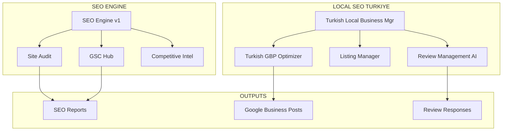

---

## 9. Voice AI & Agency Tools

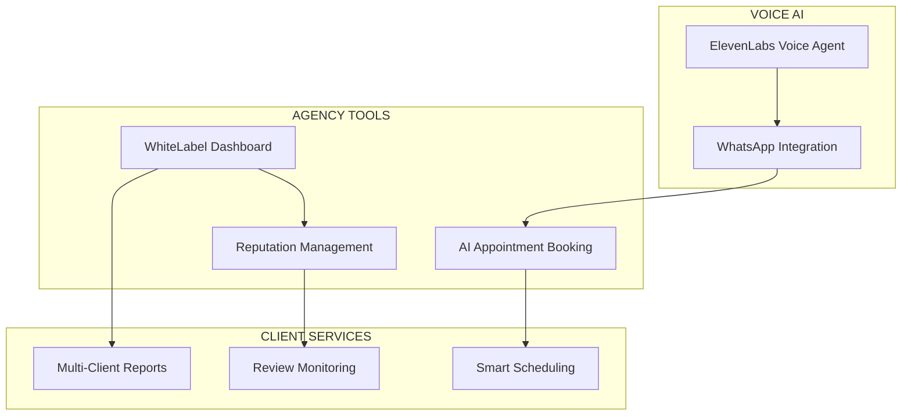

---

## 10. Tam Sistem Akis Diyagrami

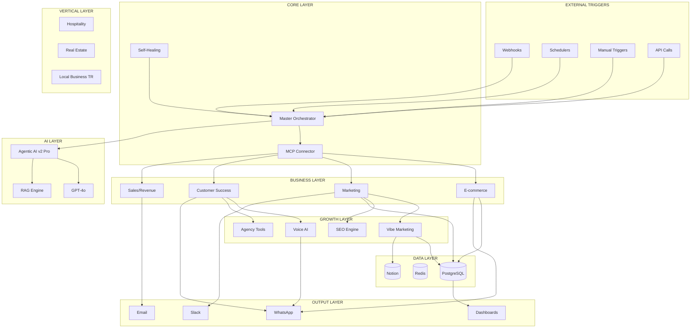

---

## 11. Tier Dagilimi

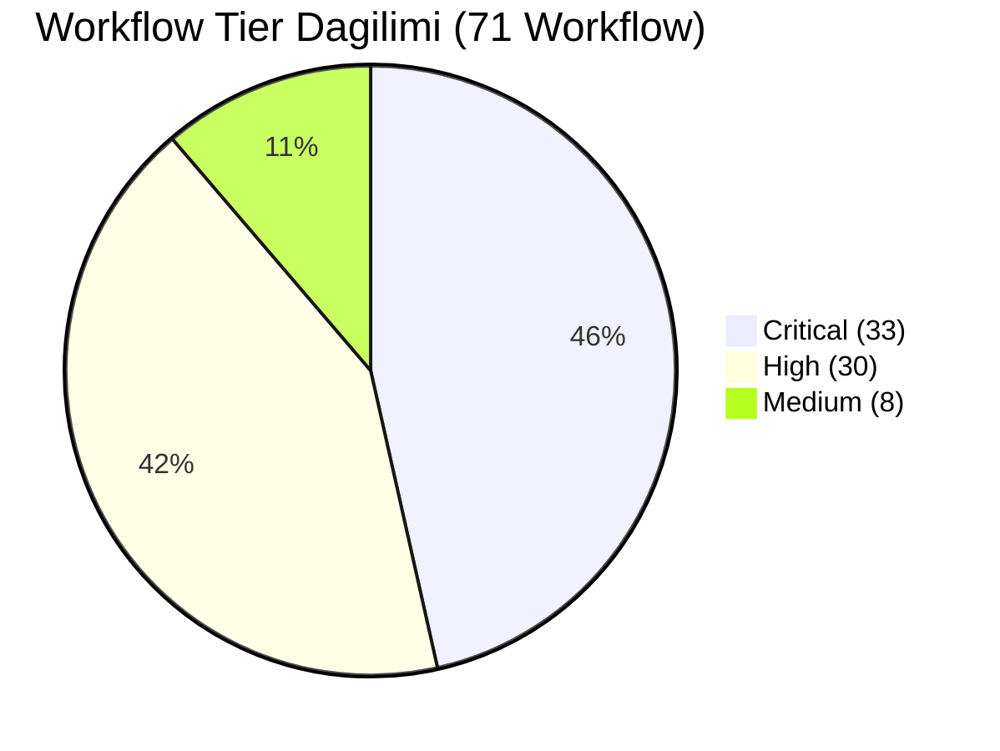

---

## 12. Modul Baslarina Workflow Sayisi

```mermaid
bar title Modul Basina Workflow Sayisi
    "Core" : 5
    "AI Engine" : 8
    "Data Intel" : 5
    "Customer Success" : 6
    "Sales Revenue" : 4
    "Marketing" : 6
    "SEO" : 4
    "Local SEO TR" : 4
    "Hospitality" : 3
    "Real Estate" : 1
    "E-commerce" : 4
    "Voice AI" : 1
    "Agency Tools" : 3
    "HR Ops" : 1
    "Finance" : 2
    "Communication" : 3
    "Notion" : 3
    "Vibe Marketing" : 5
    "Legacy Products" : 3
```

---

## 13. Teknoloji Stack

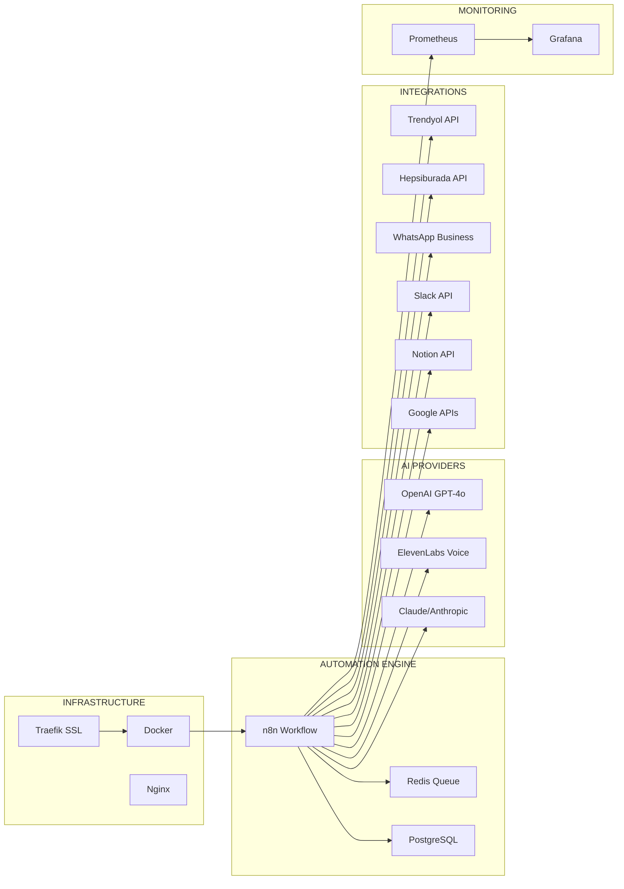

---

## Sonuc

Bu mimari diyagramlar Grain SaaS Automation Suite v5.7.0'in tam gorunumunu saglar:

- **19 Modul** - Kapsamli is otomasyonu
- **71 Workflow** - Production-ready sablonlar
- **5 Marketing Agent** - AI destekli pazarlama
- **3 Legacy Starter** - Dikey pazar cozumleri
- **Entegre Mimari** - Tum modullerin birbiriyle calismasi

---

*Diagram'lar Mermaid syntax kullanir. GitHub, Notion veya Mermaid-destekli editorde goruntulenebilir.*
