```mermaid
stateDiagram-v2
    [*] --> ScheduleTrigger: Every 5 minutes
    [*] --> WebhookTrigger: POST /trendyol/order-webhook

    ScheduleTrigger --> GetOrders: Poll Trendyol API
    WebhookTrigger --> WebhookParse: Parse webhook payload

    GetOrders --> APIResponseParse: Extract order data
    WebhookParse --> MergeOrders
    APIResponseParse --> MergeOrders: Combine both sources

    MergeOrders --> FilterNewOrders: Status = 'Created'?

    FilterNewOrders --> SaveOrder: ✓ New order
    FilterNewOrders --> [*]: ✗ Duplicate/processed

    state ParallelProcessing {
        SaveOrder --> PrepareStock: Save to PostgreSQL
        SaveOrder --> AIMessageGenerate: Generate Turkish message

        PrepareStock --> UpdateStock: Decrement inventory
        AIMessageGenerate --> WhatsAppNotify: Send confirmation

        UpdateStock --> CheckLowStock: stock < 10?
        CheckLowStock --> SlackLowStock: ⚠️ Yes, alert team
        CheckLowStock --> Continue: ✓ No

        WhatsAppNotify --> WebhookResponse
        SlackLowStock --> WebhookResponse
        Continue --> WebhookResponse
    }

    WebhookResponse --> [*]: Return success JSON

    state ErrorHandling {
        [*] --> ErrorTrigger: Exception
        ErrorTrigger --> SlackError: #trendyol-hatalar
        SlackError --> [*]
    }
```

```mermaid
stateDiagram-v2
    [*] --> Schedule15Min: Every 15 minutes
    [*] --> DailyReport: Daily 09:00
    [*] --> ManualWebhook: POST /trendyol/stock-update

    state SyncFlow {
        Schedule15Min --> GetTrendyolProducts
        ManualWebhook --> GetTrendyolProducts

        Schedule15Min --> GetLocalProducts
        ManualWebhook --> GetLocalProducts

        GetTrendyolProducts --> ParseTrendyol: Extract product data
        GetLocalProducts --> CompareStock
        ParseTrendyol --> CompareStock: Merge by barcode

        CompareStock --> FindDifferences: Identify stock gaps
        FindDifferences --> FilterUpdates: needs_update = true?

        FilterUpdates --> PreparePayload: ✓ Has differences
        FilterUpdates --> NoAction: ✗ All in sync

        PreparePayload --> UpdateTrendyol: POST price-and-inventory API
        UpdateTrendyol --> UpdateSyncTime: Mark last_sync timestamp
        UpdateSyncTime --> WebhookResponse

        state AlertPath {
            FilterUpdates --> CheckLowStock: stock <= 10?
            CheckLowStock --> CheckCritical: stock <= 3?
            CheckCritical --> SlackCritical: 🔴 URGENT
            CheckCritical --> Continue: ⚠️ Low but not critical
            SlackCritical --> WebhookResponse
        }
    }

    state DailyReportFlow {
        DailyReport --> GetStats: SELECT aggregates
        DailyReport --> GetLowStockList: Get bottom 20 products

        GetStats --> GenerateReport
        GetLowStockList --> GenerateReport: Merge data

        GenerateReport --> SendDailyReport: #trendyol-raporlar
        SendDailyReport --> [*]
    }

    WebhookResponse --> [*]
    NoAction --> [*]

    state ErrorHandling {
        [*] --> ErrorTrigger
        ErrorTrigger --> SlackError: #trendyol-hatalar
        SlackError --> [*]
    }
```

# Grain SaaS - Workflow State Machines

> Comprehensive state machine diagrams for critical Grain SaaS workflows

**Generated:** 2026-01-10
**Version:** 5.4.0
**Total Workflows Analyzed:** 6

---

## Table of Contents

1. [Master Orchestrator](#1-master-orchestrator)
2. [Trendyol Order Sync](#2-trendyol-order-sync)
3. [Trendyol Stock Manager](#3-trendyol-stock-manager)
4. [E-commerce Orchestrator](#4-e-commerce-orchestrator)
5. [Self-Healing Pipeline](#5-self-healing-pipeline)
6. [ElevenLabs WhatsApp Voice Agent](#6-elevenlabs-whatsapp-voice-agent)

---

## Overview

These state diagrams visualize the flow of data and control through Grain SaaS's critical workflows. Each diagram shows:

- **Trigger Points** - How workflows are initiated (webhooks, schedules)
- **Processing Nodes** - Data transformation and business logic
- **Decision Points** - Conditional routing and filtering
- **Actions** - External API calls, database operations, notifications
- **Error Handling** - Error triggers and recovery paths

### Architecture Patterns

All workflows follow these patterns:
- **Config-First**: Each workflow starts with `GRAIN_CONFIG` node
- **Error Resilience**: All have dedicated `Error Trigger` → `Error Alert` paths
- **Multi-Source Triggers**: Many support webhook + schedule triggers
- **Database Integration**: PostgreSQL for persistence
- **AI Enhancement**: GPT-4o for intelligent content generation
- **Notification Layer**: Slack + WhatsApp for alerts

---

## 1. Master Orchestrator

**Tier:** Critical
**Role:** Central workflow coordinator that routes events to specialized pipelines
**Triggers:** POST webhook `/orchestrator`

### Description

The Master Orchestrator is the central nervous system of Grain SaaS. It receives incoming events via webhook and routes them to the appropriate workflow chain based on the `chain` parameter. This enables a hub-and-spoke architecture where specialized workflows handle specific business processes.

### State Diagram


### Key States

- **RouteToChain**: Switch node with 5 outputs (4 named chains + fallback)
- **Chain Triggers**: HTTP requests to downstream workflow webhooks
- **RespondSuccess**: Returns JSON with `{status, chain, timestamp}`

### Integration Points

| Chain | Webhook Endpoint | Purpose |
|-------|-----------------|---------|
| `customer_lifecycle` | `/webhook/nps-response` | Customer feedback & retention |
| `lead_to_revenue` | `/webhook/lead-capture` | Sales pipeline automation |
| `hr_pipeline` | `/webhook/submit-application` | Recruitment workflow |
| `ecommerce_funnel` | `/webhook/cart-abandoned` | Cart recovery automation |

---

## 2. Trendyol Order Sync

**Tier:** Critical
**Module:** E-commerce
**Language:** Turkish
**Triggers:** Schedule (every 5 min) + POST webhook `/trendyol/order-webhook`

### Description

Dual-mode order synchronization system for Turkey's leading e-commerce marketplace Trendyol. Combines scheduled polling (every 5 minutes) with real-time webhook processing. Automatically updates local inventory, generates Turkish AI-powered customer messages via GPT-4o-mini, and sends WhatsApp order confirmations. Includes low stock alerting to Slack.

### State Diagram



### Key Features

- **Dual Trigger**: Polling (resilient) + Webhook (real-time)
- **AI Turkish Messages**: GPT-4o-mini generates personalized order confirmations
- **Stock Management**: Automatic inventory updates with low stock alerts
- **WhatsApp Integration**: Customer notifications via WhatsApp Business API
- **Database**: PostgreSQL for order persistence

### Data Flow

1. **Inbound**: Trendyol API (GET /orders?status=Created) or Webhook POST
2. **Transform**: Parse → Merge → Filter new orders
3. **Store**: PostgreSQL `orders` table
4. **Stock Update**: Decrement `products` table by quantity sold
5. **Notify**: WhatsApp (customer) + Slack (team if low stock)

---

## 3. Trendyol Stock Manager

**Tier:** Critical
**Module:** E-commerce
**Language:** Turkish
**Triggers:** Schedule (every 15 min), Daily Report (09:00), Manual webhook

### Description

Comprehensive stock synchronization and monitoring system. Compares Trendyol marketplace inventory with local PostgreSQL database every 15 minutes, automatically updates Trendyol when local stock changes, sends critical stock alerts, and generates daily reports with detailed analytics. Supports manual trigger via webhook for on-demand syncs.

### State Diagram



### Key Features

- **Bi-Directional Sync**: Trendyol ↔ Local PostgreSQL
- **Threshold Alerts**: Low stock (≤10) and Critical stock (≤3)
- **Batch Updates**: Bulk price-and-inventory API calls
- **Daily Analytics**: Comprehensive stock health report with stats
- **Manual Override**: Webhook for immediate sync

### Stock Thresholds

| Threshold | Default | Alert Channel | Urgency |
|-----------|---------|---------------|---------|
| Low Stock | ≤ 10 | #stok-uyarilari | ⚠️ Medium |
| Critical Stock | ≤ 3 | #stok-uyarilari | 🔴 High |

### Daily Report Metrics

- Total products, Total stock value
- Average stock per product
- Healthy / Low / Critical product counts
- Top 20 low-stock items with names and quantities

---

## 4. E-commerce Orchestrator

**Tier:** Critical
**Module:** E-commerce
**Triggers:** POST webhooks for order created and cart abandoned

### Description

Simplified e-commerce automation hub with two main flows: inventory management on order completion and AI-powered cart recovery. When orders are created, automatically calculates new stock levels and updates Airtable inventory. For abandoned carts, uses GPT-4o to generate personalized recovery emails with dynamic discount offers.

### State Diagram


### Key Features

- **Inventory Sync**: Airtable as inventory database
- **AI Recovery**: GPT-4o generates contextual cart recovery emails
- **Dynamic Discounts**: 10% off code (COMEBACK10) for carts > $100
- **Email Automation**: Gmail integration for customer outreach

### Cart Recovery Logic

```
IF total_price > $100 THEN
  Include discount code: COMEBACK10
ELSE
  Standard recovery message
END
```

---

## 5. Self-Healing Pipeline

**Tier:** Critical
**Module:** Core Infrastructure
**Triggers:** Schedule (every 10 min)

### Description

Autonomous infrastructure monitoring and self-correction system. Continuously checks core API health, implements exponential backoff retry strategy with dynamic wait times, and escalates to human operators when automated healing fails after 3 attempts. Enables zero-downtime operations through proactive issue detection and resolution.

### State Diagram


### Key Features

- **Proactive Monitoring**: 10-minute health checks
- **Exponential Backoff**: `wait_time = 2^attempt * 1000ms`
- **Auto-Restart**: POST to `/restart-service` endpoint
- **Smart Escalation**: Human alerting after 3 failed attempts
- **Logging**: All healing actions logged to Slack

### Retry Strategy

| Attempt | Wait Time | Action |
|---------|-----------|--------|
| 1 | 2 seconds | Retry + Restart |
| 2 | 4 seconds | Retry + Restart |
| 3 | 8 seconds | Retry + Restart |
| 4+ | — | Escalate to #devops-critical |

### Healing Actions

1. **Dynamic Backoff Wait**: Prevents overwhelming failed service
2. **Service Restart**: POST with admin authorization
3. **Logging**: Success/failure logged to #system-logs
4. **Human Escalation**: Critical alert with retry count

---

## 6. ElevenLabs WhatsApp Voice Agent

**Tier:** Critical
**Module:** Voice AI
**Language:** Turkish
**Triggers:** POST webhook from ElevenLabs Conversational AI

### Description

Advanced AI voice agent integrating ElevenLabs Conversational AI with WhatsApp Business. Processes voice messages and calls, uses GPT-4o for intent analysis and sentiment detection, personalizes responses based on customer history, routes to appropriate action handlers (appointment booking, support, inquiry), and provides bilingual support with automatic Turkish language detection.

### State Diagram


### Key Features

- **Voice AI**: ElevenLabs Conversational AI integration
- **Intent Detection**: GPT-4o multi-intent classification
- **Language Detection**: Automatic TR/EN detection via regex
- **Dual Response**: Voice (ElevenLabs) + Text (WhatsApp)
- **CRM Integration**: Customer lookup and personalization
- **Analytics**: Full conversation logging

### Intent Classification

| Intent | Description | Response Channel | Action |
|--------|-------------|------------------|--------|
| `appointment` | Booking request | WhatsApp Text | Trigger appointment workflow |
| `inquiry` | Information request | Voice (ElevenLabs) | AI-generated answer |
| `support` | Technical help | WhatsApp Text | Human escalation |
| `complaint` | Negative feedback | WhatsApp Text + Alert | Priority routing |
| `order` | Purchase inquiry | WhatsApp Text | E-commerce integration |
| `other` | Unclassified | WhatsApp Text | General response |

### AI Analysis Output

```json
{
  "intent": "appointment|inquiry|support|complaint|order|other",
  "sentiment": "positive|neutral|negative",
  "urgency": "low|medium|high",
  "extracted_info": {
    "date_mentioned": "2026-01-15",
    "time_mentioned": "14:00",
    "service_requested": "Haircut",
    "specific_request": "Women's cut with styling"
  },
  "suggested_response": "Turkish AI-generated response",
  "requires_human": false,
  "escalation_reason": null
}
```

### Customer Personalization

- **Existing Customers**: Greeting by name + interaction history
- **New Customers**: Standard welcome + preference capture
- **Language**: Auto-detected and persisted for future calls
- **Context**: Previous interactions inform response tone

---

## Appendix: Common Patterns

### A. Error Handling Pattern

All workflows implement:


### B. Configuration Pattern

All workflows start with:


### C. Webhook Response Pattern

Webhook-triggered workflows end with:


---

## Technical Notes

### Node Types Used

| Type | Purpose | Workflows |
|------|---------|-----------|
| `webhook` | HTTP trigger | All except Self-Healing |
| `scheduleTrigger` | Cron jobs | Trendyol Order/Stock, Self-Healing |
| `switch` | Conditional routing | Master Orchestrator, ElevenLabs |
| `filter` | Boolean filtering | Trendyol Order/Stock |
| `code` | JavaScript transform | All workflows |
| `postgres` | Database ops | Trendyol Order/Stock |
| `httpRequest` | External API | All workflows |
| `slack` | Team alerts | All workflows |
| `openAi` | GPT-4o inference | Trendyol Order, E-commerce, ElevenLabs |

### Database Schema

**PostgreSQL Tables:**
- `orders`: Trendyol order records
- `products`: Inventory with stock levels
- `customers`: CRM data for personalization

**Airtable Tables:**
- `Inventory`: E-commerce stock tracking

---

## Changelog

### v5.4.0 (2026-01-10)
- Added Trendyol Order Sync and Stock Manager state diagrams
- Documented Turkish AI message generation flows
- Added stock threshold alerting logic

### v5.1.0 (2026-01-09)
- Added ElevenLabs WhatsApp Voice Agent diagram
- Documented multi-intent routing and voice response paths

### v5.0.0 (2026-01-09)
- Initial state machine documentation
- Core workflows: Master Orchestrator, E-commerce, Self-Healing

---

**Generated by:** Claude Code Agent
**Repository:** https://github.com/No3214/saas
**Documentation:** /home/user/saas/docs/STATE_MACHINES.md
